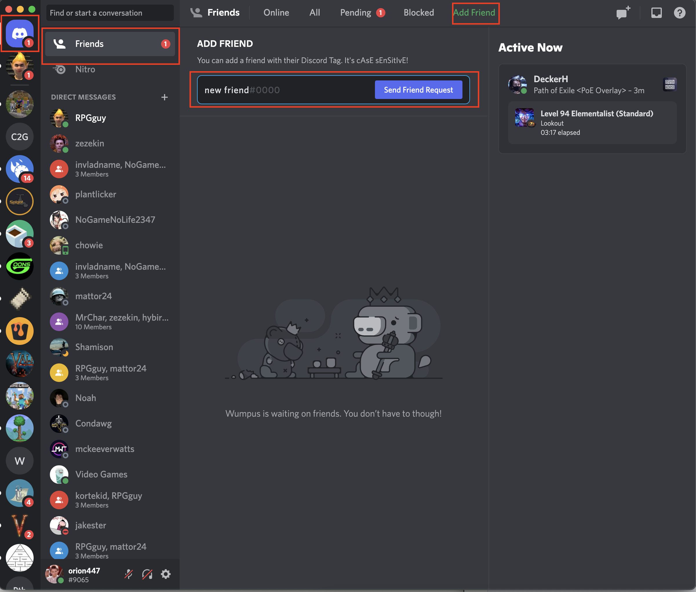

# Discord - User eXperience

[Return to Home](../)

  

Communication has become a key aspect of everyday life in the modern world. This is because we have so many tools available to us like Zoom, Slack, Discord and many more. Each all overlap on some level and yet they all have massive followings. I will briefly talk about Discord and its effective use of different tools to allow communities to grow and prosper. 

Discord is an application whose target **PERSONA** is a tech enthusiast looking for community’s that share their same interests.  Analyzing Discord through Jakob Nielsen’s 10 **USABILITY HEURISTICS** we find that it checks almost all the boxes making for a very **EFFEICIENT** user experience. Discord provides useful feedback for when a person is online, away or doesn’t want to be bothered. It also displays notifications for calls and messages as well as lets you know when someone is typing. This perfectly describes principal one from Nielsen and Discord also checks principal number 2. This is by far Discords strongest heuristic as they make it a point to use language from pop culture and use nerdy references in their UI and prompts. This makes it very appealing to their target PERSONAS. Discord hits every other principal as well; they make it easy to undo a mistake or blocking someone. Deleting or altering a message after its sent is also very straight forward. Personally, I have never had any errors with Discord, I’m not sure if it’s because I’m lucky, but it’s always been a pleasant **EXPERIENCE**. 

  

A first time user would find this software **LEARNABLE** since theres a strong emphasis on a layout that groups things together. It also lays out the most common tasks from left to right top to bottom making it simple to understand what the app is used for. If the first time user wanted to add new friend they would follow a plan simalar to this. First they would login and would be greated with the same home page. This page is always accessible by clicking the top left home botton. Once home they will see a tab labled freinds clicking the tab the user then will see a banner of listing Online, All, Pending, Blocked and a Green botton for Add Freind. Clicking the only green button for Add Friend thay see a box for username and button to send the request. Once sent the request shows up in the users Pending tab until added or blocked.

Discords **USER EXPERIENCE** is why it has grown in popularity so rapidly over the past few years. Its ability to connect with its target audience on this kind of level is something that I haven’t seen done by any other app. Although highly targeted at a certain **PERSONA** Discord has been able to break out of this niche and now offers a place for gamers to crocheters to easily connect and share. 
