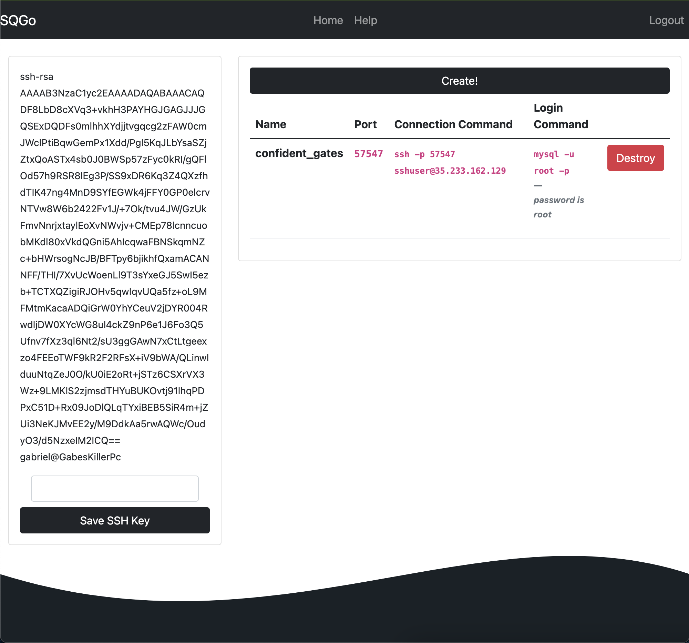

# Capstone Project - User eXperience

[Return to Home](../)

  

  

  

  For my final journal entry, I will be reviewing my own senior capstone project. During the development of this web application the goal was to make it as **SIMPLE** as possible. The point of the project was to create a way for students to rapidly deploy MySQL servers to connect to and work on. Although there are similar applications offered by GCP and AWS I wanted to focus on the idea of one click and its working. If I would have taken 431W prior to my capstone some of the design ideas, I learned in 431W I would have taken into consideration. Now after completing both 431W and my project I want to go back and dissect some of my design choices.

  The login screen is the first screen users are greeted with, I wanted to make it **SIMPLE** and not clutter the screen. I don’t have any information posted on this screen besides the website name, login prompt, and a “join” link. The major design choice here was not having any other information on the landing page besides a login prompt. Redesigning this, I would like to have a more complete landing page. Something that describes what the application does and why someone would want to use it. In its current state the site **ASSUMES** that the user has **PRIOR KNOWLEDGE** of the application. Moving on after logging in the user is greeted with the main **DASHBOARD**.

  This is the main activity screen and I wanted it to keep it clean and functional. There is 2 labeled buttons, a text box, and a red button next to a row item. At the top of the screen there is a navbar with Home, Help, and Logout. I also use different text styles and colors to add **EMPHASIS** on key aspects. I chose to use a magenta color for text that is important for the user to know like the connection command and login command. I also chose to have the destroy button in red as it’s the button that deletes the associated MySQL server. However, information on how to use the site is hidden away in the Help navbar link. Having tool tips or more apparent help icons, I believe would be beneficial. Once again, I feel the site is relying on a user with preexisting knowledge of how to use it.

Moving onto the last page, the help page. Again, keeping the same clean and non-cluttered aesthetic. There are two dropdowns for Windows and Mac. At the top of the page is a short description of what the site does. Clicking on one of the drop downs is a step-by-step guide on how to use the site based on being on Mac or Windows. After learning how to use the site it’s very easy to **MEMORIZE** as there’s not that much else to do besides create and destroy servers. Making the help page more apparent instead of just a muted navbar link I think would add value.

  **ANALYZING** my web application from a usability prospective has provided some useful information that I will take forward in this project’s lifecycle. The biggest takeaway for me is the ASSUMPTION that the site makes of the user having knowledge of functionality of the site itself. During the design process I should have taken a more first time use perspective. But I’m very happy with the design elements that I have implemented, like font choices and color choices to add emphasis on key aspects. 
